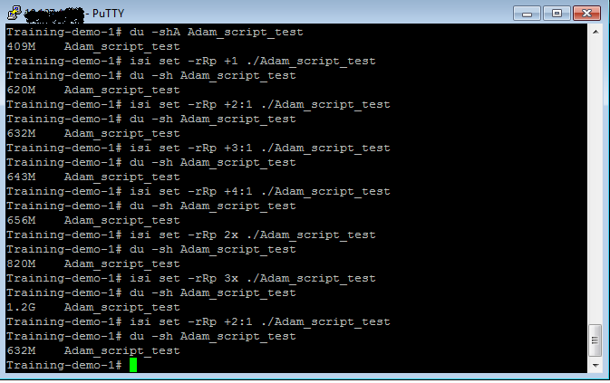

# Isilon Capacity calculator

Isilon has a unique approach to data protection protecting individual files, rather than protecting complete disks (as in RAID).

This file level protection allows for great flexibility when storing large quantities of data but has the drawback of being tough
to calculate.  If you were to use RAID 5 (4+1) and you asked what the overhead for this protection is, it would be simple (1/5 - 20% of your disk 
capacity would be used for protection.  On an Isilon system this would not be so simple and we'd need more information for calculating the overhead 
and therefore the raw capacity needed;

* What is the protection type? (2x,3x,4x,5x,6x,7x,8x,n+1,n+2,n+3,n+4,n+2:1,n+3:1,n+4:1,n+3:11,n+4:2)
* What is the size of the node pool? (group of identical nodes)
* how big is each individual file?
* How many files/directories are there? (each needs metadata)

Because the files are processed individually we'd need to use this information to calculate the resulting size of each file.

This script simply needs to be run on the host that can see the data to be migrated.  You supply it with the details needed to
calculate the eventual capacity and it will run through each file and calculate the resulting Isilon capacity (including metadata).

## Usage:

Firstly you need the Python shell to run the script.  Python is available for many platforms (Windows, Linux, Unix, OSX and others)
[download Python](https://www.python.org/downloads/)

Then run the script using the following syntax:

`python isilon_capacity_calc.py <source directory> -s <size of nodepool> -p <protection type>`

for example:

`python isilon_capacity_calc.py /Users/weeksa/Documents/ -s 9 -p n+2:1`

Additional options:

`[-v (for verbose file list printed) | -c (for csv formatted verbose output) | -u output data units (KB,MB,TB,PB,H), default=H (H=human/auto sizing)]`

verbose mode will give you a list of individual files on screeen, CSV is meant for creating a .CSV file (can be opened in a spreadsheet for ease of reading)
note with CSV output you have to direct the output of the command into a file, like so:

`python isilon_capacity_calc.py <source directory> -s <size of nodepool> -p <protection type> -u <data measurement units> -c > myfiles.csv`


Output:
```
Reading metadata...
Read metadata for  8019  files in (H:M:S:ms): 0:00:00.446705

Calculating filesizes...
Percent: [########################################] Done!

Original data size is:  26 GB
Isilon size is       :  29 GB
A protection overhead of  11.54 % - percentage of additional protection data

Calculation time (H:M:S:ms):   0:00:00.147969
Total running time (H:M:S:ms): 0:00:00.594736
```

## As this script is still in testing...
**_PLEASE UPDATE THE ABOVE WIKI WITH ANY ACCURACY TESTS/REPORTS! _**

For testing results see the [results_comparison_table.md](results_comparison_table.md) file; it does show that there are differences of a few percent in my testing thus far. 

## Working test comparison

From a real Isilon cluster Node pool was 3 X200s.

- du -shA 
-- Shows size of directory *without including* protection data (A for Apparent data size)
- du -sh
-- Shows the size of the dir *including* protection data
- isi set -rRp '<protection><dir>' 
-- Changes the protection level of the data on the fly

### On Isilon test cluster:

### Using script:

```

Linux:Documents user1$ python isilon_capacity_calc.py /Users/user1/Desktop/isilon\ script\ test\ dir/ -s 3 -p n+1 -u MB
Reading metadata...
Read metadata for  158  files in (H:M:S:ms): 0:00:00.025643

Calculating filesizes...
Percent: [########################################] Done!

Original data size is:  407 MB
Isilon size is       :  624 MB
A protection overhead of  53.42 % - percentage of additional protection data

Calculation time (H:M:S:ms):   0:00:00.002213
Total running time (H:M:S:ms): 0:00:00.027898
Linux:Documents user1$ python isilon_capacity_calc.py /Users/user1/Desktop/isilon\ script\ test\ dir/ -s 3 -p n+2:1 -u MB
Reading metadata...
Read metadata for  158  files in (H:M:S:ms): 0:00:00.030907

Calculating filesizes...
Percent: [########################################] Done!

Original data size is:  407 MB
Isilon size is       :  632 MB
A protection overhead of  55.27 % - percentage of additional protection data

Calculation time (H:M:S:ms):   0:00:00.002148
Total running time (H:M:S:ms): 0:00:00.033103
Linux:Documents user1$ python isilon_capacity_calc.py /Users/user1/Desktop/isilon\ script\ test\ dir/ -s 3 -p n+3:1 -u MB
Reading metadata...
Read metadata for  158  files in (H:M:S:ms): 0:00:00.035157

Calculating filesizes...
Percent: [########################################] Done!

Original data size is:  407 MB
Isilon size is       :  645 MB
A protection overhead of  58.45 % - percentage of additional protection data

Calculation time (H:M:S:ms):   0:00:00.002990
Total running time (H:M:S:ms): 0:00:00.038216
Linux:Documents user1$ python isilon_capacity_calc.py /Users/user1/Desktop/isilon\ script\ test\ dir/ -s 3 -p n+4:1 -u MB
Reading metadata...
Read metadata for  158  files in (H:M:S:ms): 0:00:00.024812
```
Please note that this script is **completely unsupported by Dell Technologies/EMC/Isilon** and should be considered as in a beta state/
experimental.  Although written in good faith there are of course **no guarantees** the results will be accurate.

If you discover any issues, have any feature suggestions please contact me at 
Adam.Weeks@dell.com
  